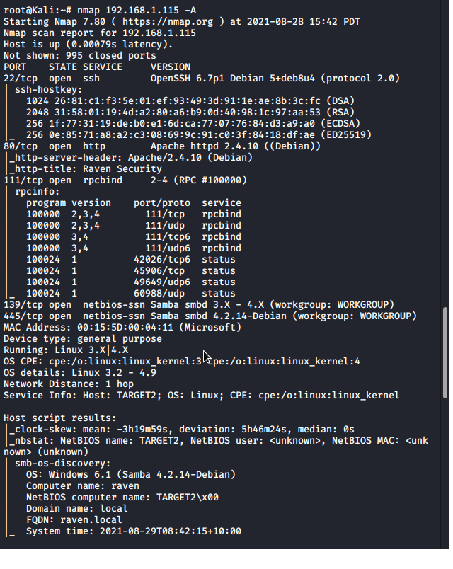
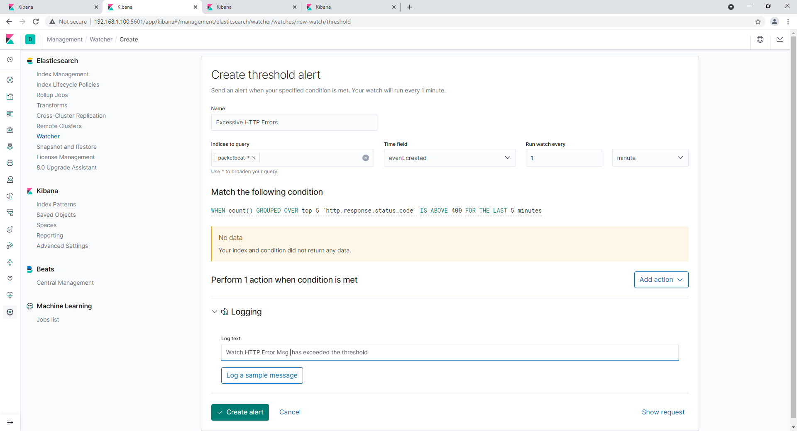
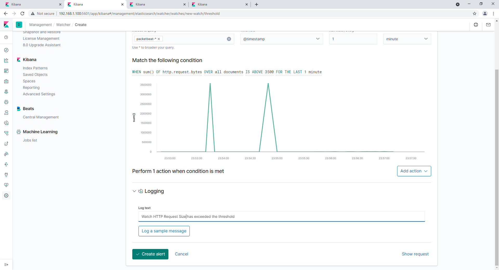
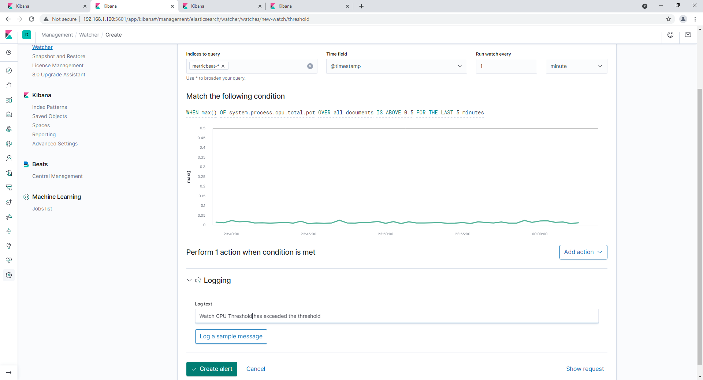

# Blue Team: Summary of Operations

## Table of Contents
- Network Topology
- Description of Targets
- Monitoring the Targets
- Patterns of Traffic & Behavior
- Suggestions for Going Further

### Network Topology

```bash

   The following machines were identified on the network:
   - Name of VM 1
     - **Operating System**:  Linux 3.2-4.9
     - **Purpose**:  Wordpress Server
     - **IP Address**: 192.168.1.110
 ```
  
  
```bash  
    
   - Name of VM 2
     - **Operating System**: Linux 3.2-4.9
     - **Purpose**: Wordpress Server
     - **IP Address**: 192.168.1.115
```
 
 

### Description of Targets

```bash

   The target of this attack was: `Target 1`: 192.168.1.110

   Target 1 is an Apache web server and has SSH enabled, so ports 80 and 22 are possible ports of entry for attackers. As such, the following alerts have been implemented:
```

#### Name of Alert 1

```bash
   'Excessive HTTP Errors' is implemented as follows:
     - **Metric**: http.response.status.code
     - **Threshold**: 400 every 5 minutes
     - **Vulnerability Mitigated**: A brute force attack would generate HTTP error responses.  This Watcher alerts if there are an excessive number of HTTP requests in a short period of time
     - **Reliability**: TODO: Based on volume of network traffic, this watcher generates a low amount of false positives.
```
 

#### Name of Alert 2

```bash
   'HTTP Request Size' is implemented as follows:
  - **Metric**: http.request.bytes
  - **Threshold**: 3500 per 1 minute
  - **Vulnerability Mitigated**: A comparitvely large volume of traffic moving ovewr the system would be unusual and warrant investigation.
  - **Reliability**: TODO: Based on volume of network traffic, this Watcher should not trigger many flase positives.
```
 

#### Name of Alert 3

```bash
   Alert 3 is implemented as follows:
     - **Metric**: system.process.cpu.total.pct
     - **Threshold**: .5 over 5 minutes
     - **Vulnerability Mitigated**: If the system CPU is working excessively, it could indicate abnormal processes are occuring on the system which should be investigated as potential threats 
     - **Reliability**: Based on system history, a very low amount of system resources are consumed in the normal course of business, so a spike in utilization would be abnormal.  This would make the rate of false positives low
```
 

