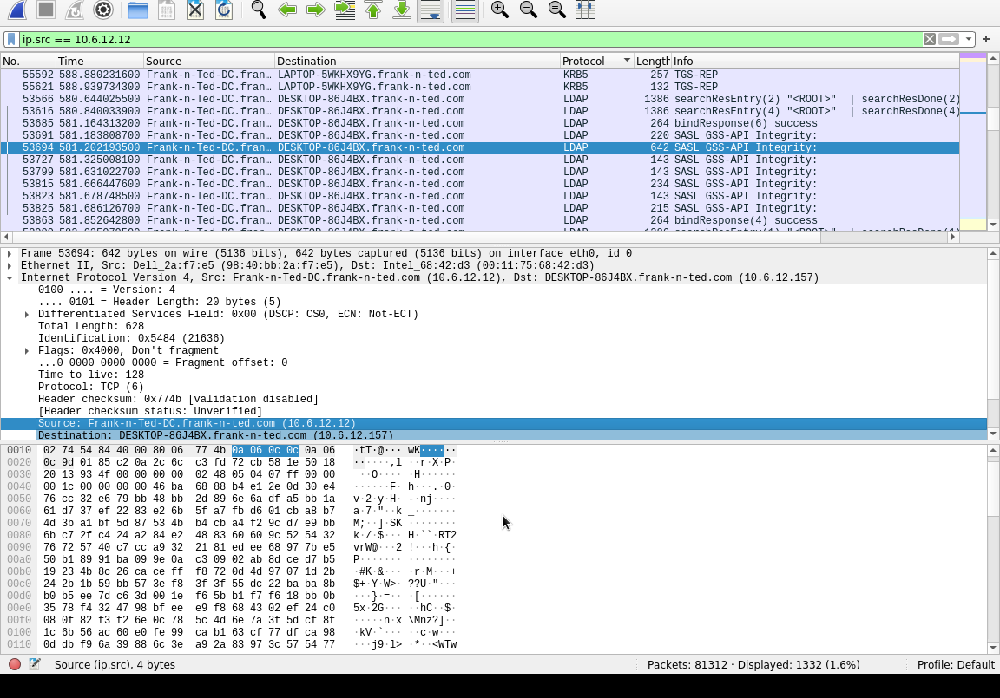
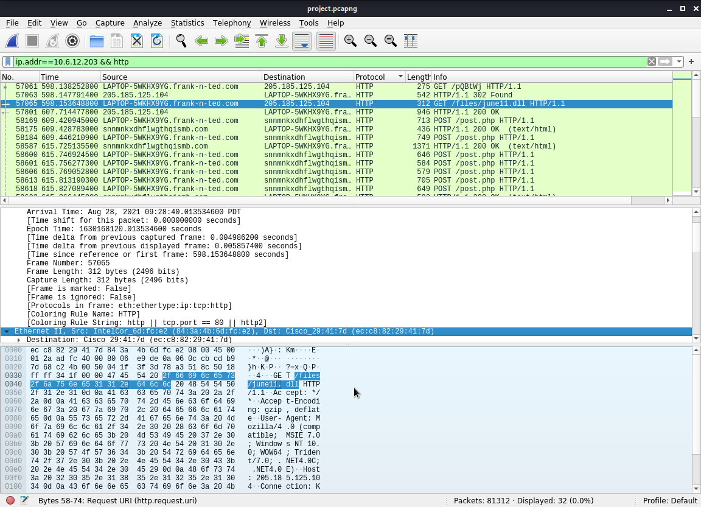
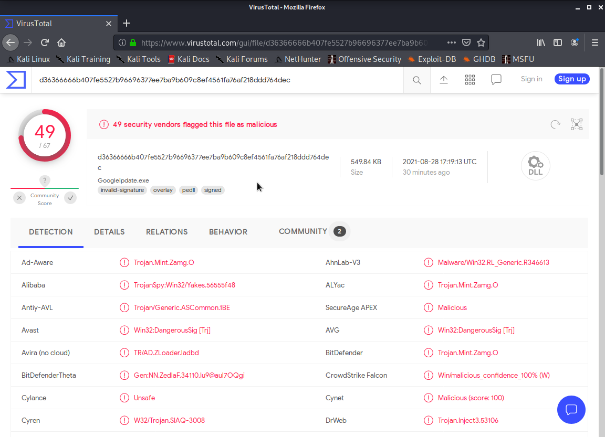
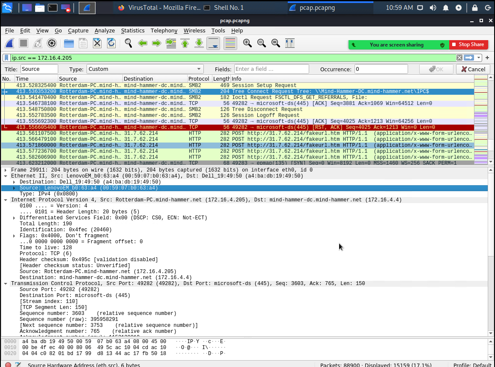
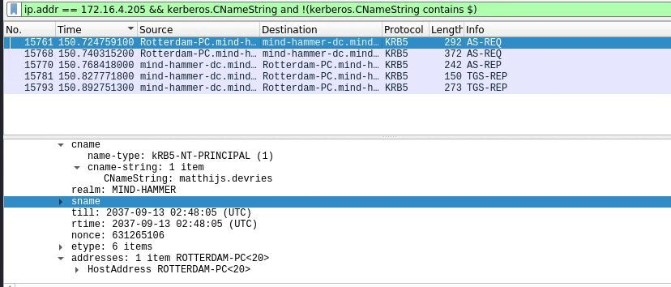
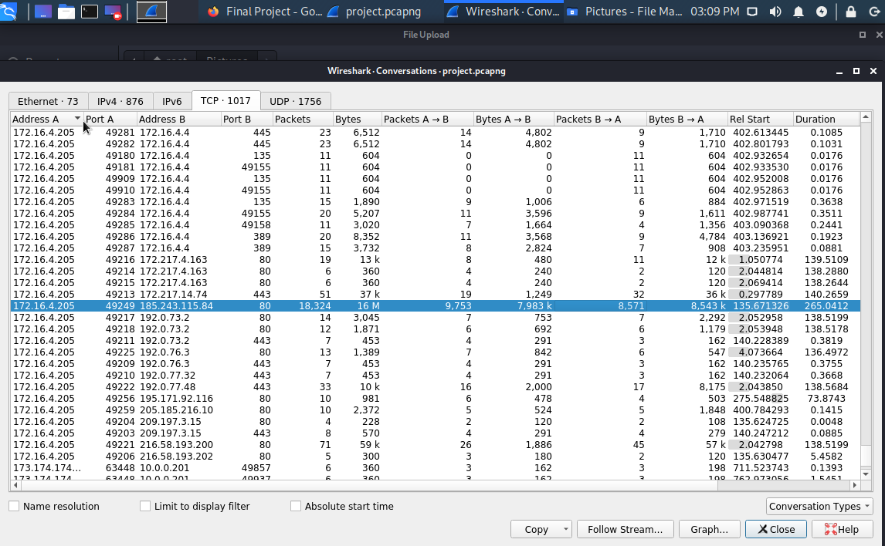

 Network Forensic Analysis Report


```bash

  ## Time Thieves ##
  You must inspect your traffic capture to answer the following questions:

   1. What is the domain name of the users custom site?
      -frank-n-ted.com

   2. What is the IP address of the Domain Controller (DC) of the AD network?
      -10.6.12.12

  Both of these answers can be found here:
```
 
 
```bash
   3. What is the name of the malware downloaded to the 10.6.12.203 machine?
      -June11.dll
```
 
 
 ```bash
   ## Once you have found the file, export it to your Kali machine's desktop. ##
Upload the file to [VirusTotal.com](https://www.virustotal.com/gui/). 

5. What kind of malware is this classified as?
   -Trojan
```
 

 Vulnerable Windows Machine

```bash
   1. Find the following information about the infected Windows machine:
      - Host name: ROTTERDAM-PC
      - IP address: 172.16.4.205
      - MAC address: 00:59:07:b0:63:a4
```
 
    
```bash   
   2. What is the username of the Windows user whose computer is infected?
      -mattijs.dervies
```
 
 
 ```bash
   3. What are the IP addresses used in the actual infection traffic?
      -185.243.115.84
 ```
  

---

## Illegal Downloads

1. Find the following information about the machine with IP address `10.0.0.201`:
    - MAC address
    - Windows username
    - OS version

2. Which torrent file did the user download?
