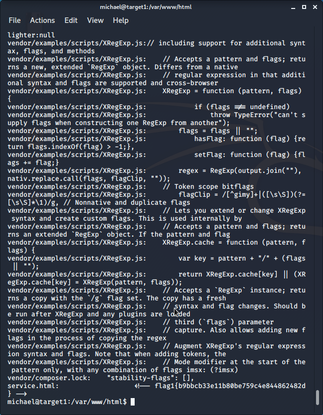

# Red Team: Summary of Operations

## Table of Contents
- Exposed Services
- Critical Vulnerabilities
- Exploitation

### Exposed Services


Nmap scan results for each machine reveal the below services and OS details:

```bash
$ nmap 192.168.1.110 -A
```
  

This scan identifies the services below as potential points of entry:
- Target 1
  - List of
  - Exposed Services 
  
  22  SSH
  80  http
  111  rpcbind
  139 netbios-ssn
  445 microsoft-ds


The following vulnerabilities were identified on each target:
- Target 1
  - List of
  - Critical
  - Vulnerabilities

 ```bash
   Port    Service      Version 
   22      ssh          OpenSSH 6.7p1
   80      http         Apache httpd 2.4.10
   111     rpcbind      2-4
   139     netbios-ssn  Samba smdb 3.x
   445     netbios-ssn  Samba smbd 3.x
 ```

   

### Exploitation


The Red Team was able to penetrate `Target 1` and retrieve the following confidential data:

```bash

- Target 1
  - `flag1.txt`:
  ```
   
   
    - **Exploit Used**
      - _TODO: Identify the exploit used_
      - _TODO: Include the command run_
  - `flag2.txt`: _TODO: Insert `flag2.txt` hash value_
    - **Exploit Used**
      - _TODO: Identify the exploit used_
      - _TODO: Include the command run_
