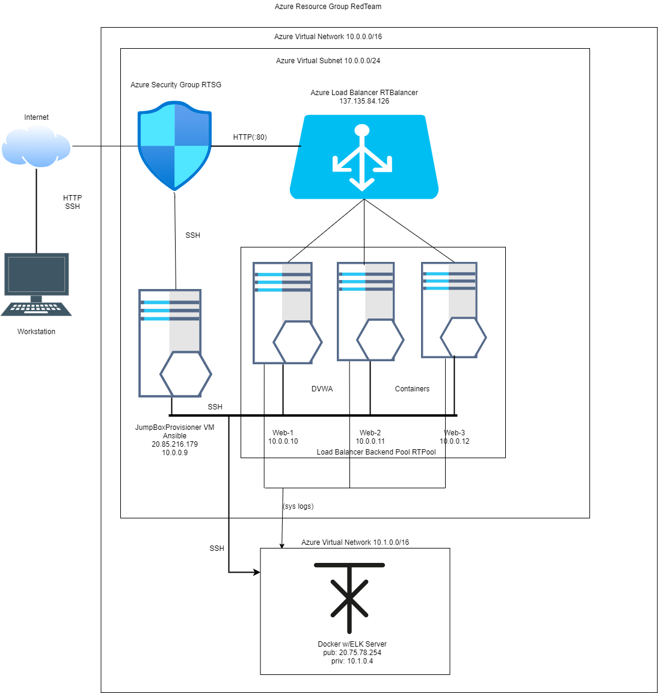

## Automated ELK Stack Deployment

The files in this repository were used to configure the network depicted below.

These files have been tested and used to generate a live ELK deployment on Azure. They can be used to either recreate the entire deployment pictured above. Alternatively, select portions of the filebeat-playbook.yml file may be used to install only certain pieces of it, such as Filebeat.

 

This document contains the following details:
- Description of the Topologu
- Access Policies
- ELK Configuration
  - Beats in Use
  - Machines Being Monitored
- How to Use the Ansible Build

### Description of the Topology

The main purpose of this network is to expose a load-balanced and monitored instance of DVWA, the D*mn Vulnerable Web Application.

Load balancing ensures that the application will be highly available, in addition to restricting access to the network.
   The load balancer ensures that there is maximum availabilty for the pool of machines while protecting access to the individual machines to specfic ports/services.  Using a well protected jump box to provision the web servers allows for a strict lockdown of the machines using SSH access only, eliminating the possibility of 

Integrating an ELK server allows users to easily monitor the vulnerable VMs for changes to the logs and system metrics and activity.

The configuration details of each machine may be found below.

| NAME               | FUNCTION   | IP ADDRESS | OPERATING SYSTEM |
|--------------------|------------|------------|------------------|
| JumpBoxProvisioner | Gateway    | 10.0.0.9   | Ubuntu 18.04     |
| Web-1              | Webserver  | 10.0.0.10  | Ubuntu 18.04     |
| Web-2              | Webserver  | 10.0.0.11  | Ubuntu 18.04     |
| Web-3              | Webserver  | 10.0.0.12  | Ubuntu 18.04     |
| ELKServer          | ELK Server | 10.1.0.4   | Ubuntu 18.04     |

### Access Policies

The machines on the internal network are not exposed to the public Internet. 

Only the JumpBoxProvisioner machine can accept connections from the Internet. Access to this machine is only allowed from the following IP addresses:  xxx.xxx.xxx.xx5
(IP obfuscated for security purposes)

Machines within the network can only be accessed by the JumpBoxProvisioner.
- _Provisioner internal ip 10.0.0.9

A summary of the access policies in place can be found in the table below.

| NAME               | Publicly Accessible | Allowed IP Addresses     |
|--------------------|---------------------|--------------------------|
| JumpBoxProvisioner | Yes                 | XXX.XXX.XXX.XX5          |
| Web-1              | No                  | 10.0.0.9                 |
| Web-2              | No                  | 10.0.0.9                 |
| Web-3              | No                  | 10.0.0.9                 |
| ELKServer          | Yes/No              | XXX.XXX.XXX.XX5/10.0.0.9 |

### Elk Configuration

Ansible was used to automate configuration of the ELK machine. No configuration was performed manually, which is advantageous because using Ansible playbooks allows for easily scaleable, identifcal deployments vs individual manual install processes.

The install-elk playbook implements the following tasks:
- Installs the docker io_
- Installs python3 and the docker python module
- Configures the docker container to allow access to more memory
- Downloads and launches a docker ELK container
- Ensures the ELK docker services starts on boot of the machine

The following screenshot displays the result of running `docker ps` after successfully configuring the ELK instance.

### Target Machines & Beats
This ELK server is configured to monitor the following machines:
- Webserver-1/2/3 at 10.0.0.10, 10.0.0.11, 10.0.0.12

I have installed filebeats and metricbeats on each of the webservers via Ansible playbooks

These Beats allow us to collect the following information from each machine:

- Filebeats: allows for the input of specific log files and automates the harvesting of the logs for retention and analysis at a later date
- Metricbeats: allows for the collection of specifc OS and specified service metrics running on the system and sends them to a designated output such as Elasticsearch or Logstash.

### Using the Playbook
In order to use the playbook, you will need to have an Ansible control node already configured. Assuming you have such a control node provisioned: 

SSH into the control node and follow the steps below:
- Copy the install-elk file to /etc/ansible.
- Update the /etc/ansible/hosts file to include the IP of the ELK server under the [elk] section
- Run the playbook, and navigate to 20.75.78.254:5601/app/kibana to check that the installation worked as expected.

To run the elk-install playbook, on the JumBoxProvisioner:

- navigate to /etc/ansible
- run the command ansible-playbook elk-install.yml
=======

To run the elk-install playbook, on the JumBoxProvisioner:

- navigate to /etc/ansible
- run the command: ansible-playbook elk-install.yml

